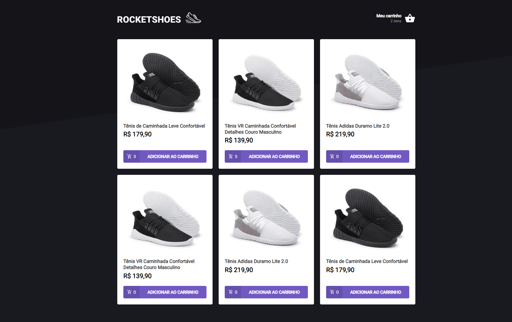

<h1 align="center">Rocketshoes</h1>
<h2 align="center">Rocketseat - Ignite - ReactJS</h2>

<h3 align="center">Chapter #2 - Challenge #1</h3>

  <a href="#-Project">Project</a>&nbsp;&nbsp;&nbsp;|&nbsp;&nbsp;&nbsp;
  <a href="#hammer_and_wrench-Features">Features</a>&nbsp;&nbsp;&nbsp;|&nbsp;&nbsp;&nbsp;
  <a href="#-Technologies">Technologies</a>&nbsp;&nbsp;&nbsp;|&nbsp;&nbsp;&nbsp;
  <a href="#-How-to-execute">How to execute</a>&nbsp;&nbsp;&nbsp;|&nbsp;&nbsp;&nbsp;
  <a href="#-Licence">Licence</a>

  

## 💻 Project

Rocketshoes is a app to manage your store of any product. This is the third challenge of ReactJS track of Ignite course from [Rocketseat](https://rocketseat.com.br/).

## :hammer_and_wrench: Features

- [x] List products
- [x] Add products to the cart
- [x] Add products to the cart
- [x] Alter amount of each product in the cart

## ✨ Technologies

This project was developed with the technologies above:

- [React](https://reactjs.org)
- [TypeScript](https://www.typescriptlang.org)
- [Jest](https://jestjs.io)
- [Styled Components](https://styled-components.com)
- [JSON Server](https://github.com/typicode/json-server)
- [Axios](https://axios-http.com)
- [React-toastfy](https://fkhadra.github.io/react-toastify)
- [React Icons](https://react-icons.github.io/react-icons)
- [React Router](https://reactrouter.com)
- [Polished](https://polished.js.org)

## 🚀 How to execute

- Clone the repository
- Install de dependencies with `yarn`
- Run the server with `yarn server`
- Run the application with `yarn start`
- Run the tests with `yarn test`
- Access [`localhost:3000`](http://localhost:3000) in your browser

## 📄 Licence

This project is under the MIT license. See the [LICENSE](./LICENSE) file for more details.

---

Made with ♥ by Jonathan Alba Videira and Rocketseat
